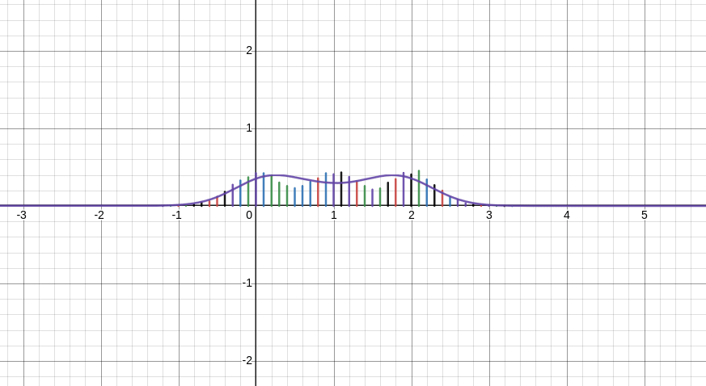

## Generative ML
This is a compilation of the generative ML techniques I learnt in EE698

### Checklist
- [x] Common Distribution(Gaussian, Bernoulli, Gaussian Mixture) samplers from a uniform sampler and their visualizations 
- [ ] Multivariate Distribution Samplers 
- [x] EM Maximization for Scaler Gaussian Mixture 
- [ ] EM Maximization for Multivariate Gaussian Mixture 
- [ ] EM Maximization for Bernoilli 
- [x] Variational Autoencoder 
- [x] GANs 
- [x] Rejection Sampling 

### Visualizations
Visualizations are done on desmos using [desmos-server](https://github.com/ShivamIITK21/desmos-server). Eg. the following shows iterations of EM Maximization

